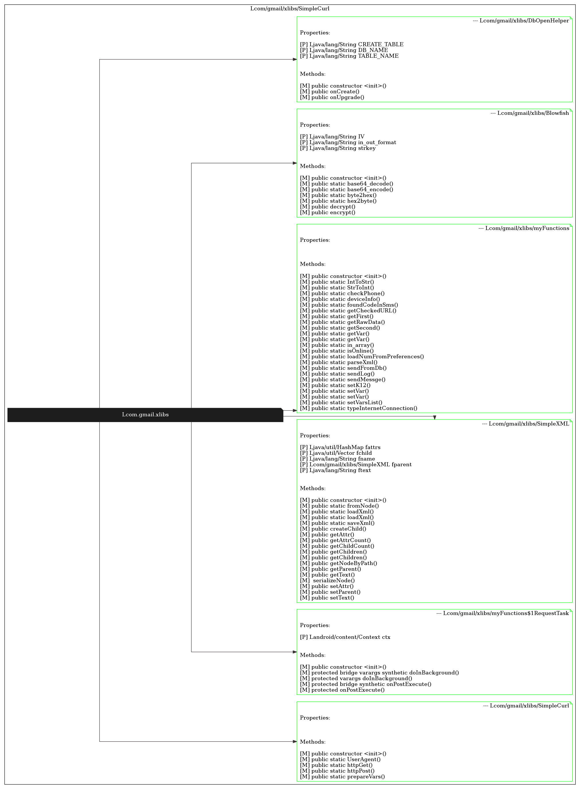
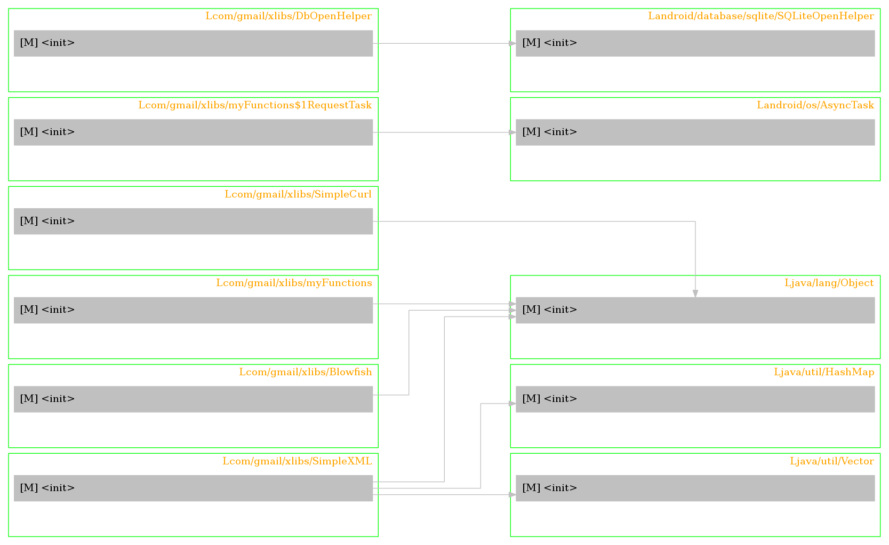
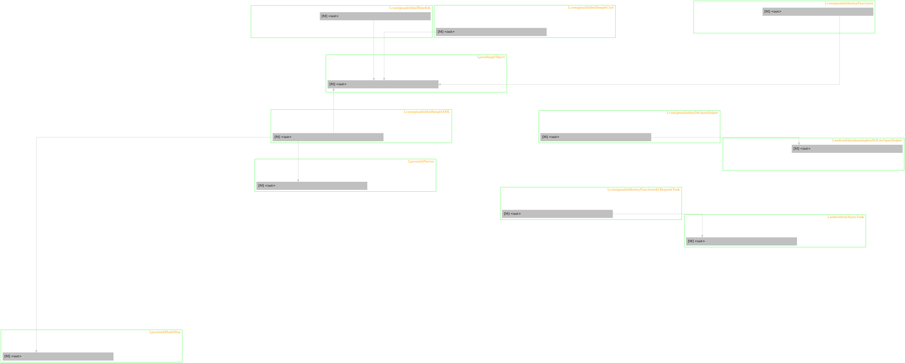
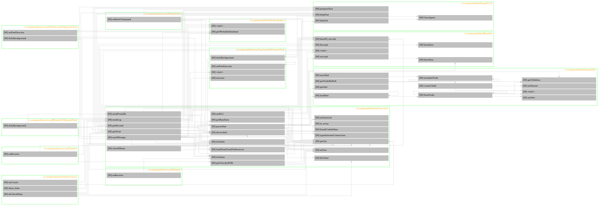
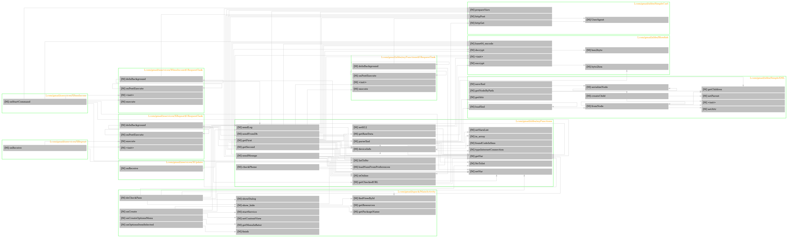

.. _page-screenshots:

****************
Screenshots 
****************

General usage
=============

.. code-block:: python

    $ smalisca --help

.. code-block:: python
    
    $ smalisca parser -l ~/tmp/FakeBanker2/dumped/smali -s java -f sqlite  -o /tmp/fakebanker.sqlite

Analysis
========

    Search for classes using interactive prompt

    Search for calls using interactive prompt

.. figure:: _static/images/smalisca_general_help.png
    :width: 99%
    :align: center
    :alt: alternate text
    :figclass: align-center

    General help / usage

Drawing
=======

dc
--

.. code-block:: python

    smalisca>dc -c class_name -p gmail/xlibs -f png --prog dot -o /tmp/smalisca/classes.png

.. code-block:: python

    smalisca>dc -c class_name -p gmail/xlibs -f png --prog fdp -o /tmp/smalisca/classes.png

    

dcl
---

.. code-block:: python

    smalisca>dcl -fc gmail/xlibs -fm init -f png --prog dot -o /tmp/smalisca/calls.png

.. code-block:: python

    smalisca>dcl -fc gmail/xlibs -fm init -f png --prog fdp -o /tmp/smalisca/calls.png

dxcl
----
    
.. code-block:: python
    
    smalisca>dxcl -c gmail/xlibs -d to --max-depth 0 -f png --prog dot -o /tmp/smalisca/xcalls.png

.. code-block:: python
    
    smalisca>dxcl -c gmail/xlibs -d to --max-depth 1 -f png --prog dot -o /tmp/smalisca/xcalls.png

.. code-block:: python
    
    smalisca>dxcl -c gmail -m create -d from --max-depth 1 -f png --prog dot -o /tmp/smalisca/xcalls.png 

.. figure:: _static/images/smalisca_dxcl_dot_1_1.png
    :width: 99%
    :align: center
    :alt: alternate text
    :figclass: align-center

    
